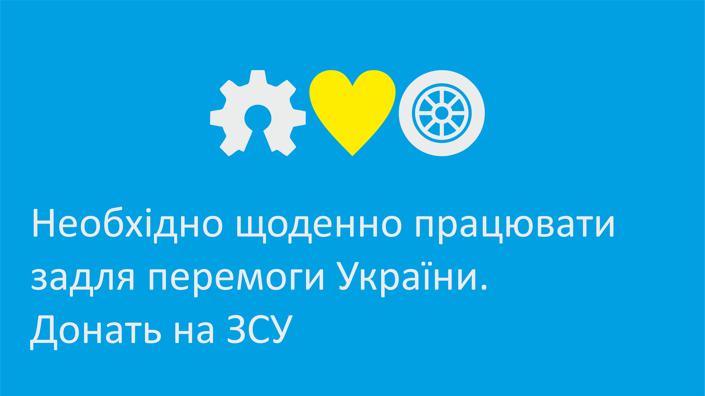
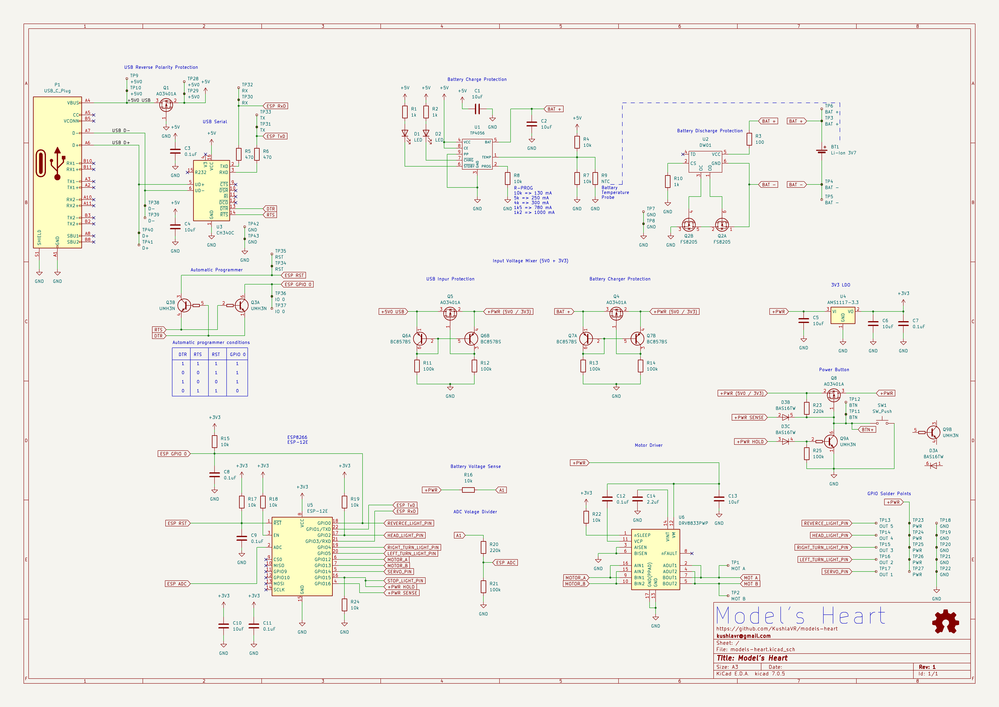
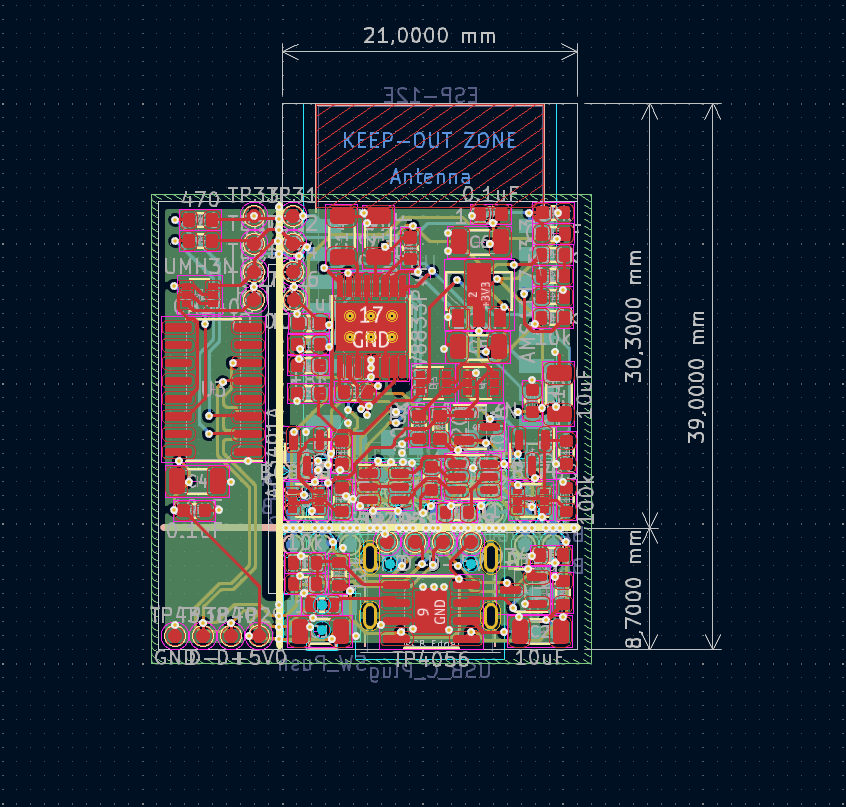
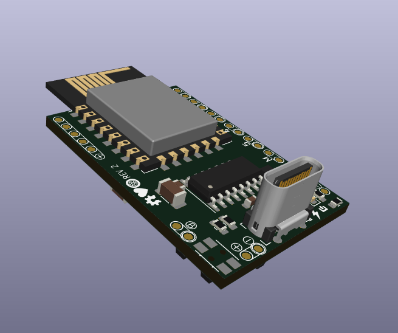
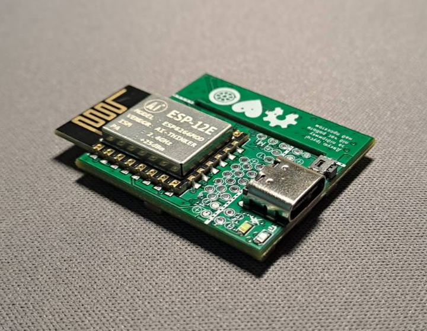

# Model's Heart

## Breathe life into your model


# Поки ти читаєш цей текст - українці гинуть від російських ракет.

Ти можеш перерахувати будь-яку суму на спеціальний рахунок Національного Банку України для допомоги збройним силам україни у протистоянні російському окупанту.
Навть незначна сума може врятувати чиєсь життя!

### Для зарахування коштів у національній валюті:

Банк: Національний банк України

МФО 300001

Рахунок № UA843000010000000047330992708

код ЄДРПОУ 00032106

Отримувач: Національний банк України 

### Для зарахування коштів у USD: 

BENEFICIARY: National Bank of Ukraine

BENEFICIARY BIC: NBUA UA UX

BENEFICIARY ADDRESS: 9 Instytutska St, Kyiv, 01601, Ukraine

ACCOUNT NUMBER: 804790258

BENEFICIARY BANK NAME: JP MORGAN CHASE BANK, New York

BENEFICIARY BANK BIC: CHASUS33

ABA 0210 0002 1

BENEFICIARY BANK ADDRESS: 383 Madison Avenue, New York, NY 10017, USA

PURPOSE OF PAYMENT: for ac 47330992708 

### Для зарахування коштів у EUR: 

BENEFICIARY: National Bank of Ukraine

IBAN DE05504000005040040066

PURPOSE OF PAYMENT: for ac 47330992708

BENEFICIARY BANK NAME: DEUTSCHE  BUNDESBANK, Frankfurt

BENEFICIARY BANK BIC: MARKDEFF

BENEFICIARY BANK ADDRESS: Wilhelm-Epstein-Strasse 14, 60431 Frankfurt Am Main, Germany

### Для зарахування коштів у GBP: 

BENEFICIARY/RECIPIENT NAME: National Bank of Ukraine

ACCOUNT NUMBER: 80033041

IBAN GB52CHAS60924280033041

BENEFICIARY ADDRESS: 9 Instytutska St, Kyiv, 01601, Ukraine

BENEFICIARY BANK NAME: JP MORGAN CHASE BANK NA, London

BENEFICIARY BANK BIC: CHASGB2L

SORT CODE: 60-92-42 

BENEFICIARY BANK ADDRESS: 125 London Wall, London EC2Y 5AJ, UK

PURPOSE OF PAYMENT: for ac 47330992708





## Schematic



## PCB



# Board





# Елементи UI
## Text
```
    {
        "type":"text",
        "x": int,
        "y": int,
        "w": int,
        "h": int,
        "text":string,
        "bg":string
    }
```

## Button
```
    {
        "type":"button",
        "x": int,
        "y": int,
        "w": int,
        "h": int,
        "text": string,
        "cmd": string
    }
```

## Slider
```
    {
        "type":"slider",
        "x": int,
        "y": int,
        "w": int,
        "h": int,
        "color": string,
        "cmd": string,
        "autoconter": bool,
    }
```

## Сценрій
```
    {
        "cmd": string,
        "type": "tougle/click",
        "actions": 
            [
                {
                    "type": 
                    "cmd": string,
                },
                {
                    "type": "motor",
                    "cmd": string (source of motor speed values),
                    "a": string (source of A half bridge values),
                    "b": string (source of B half bridge values),
                    "weight": int (in grams)
                },
                {
                    "type": "blink",
                    "points": [
                        {"pin": "1", "offset":"0", "value":"0"},
                        {"pin": "1", "offset":"500", "value":"255"},
                        {"pin": "1", "offset":"1000", "value":"0"}
                    ]
                }
            ...
            ]

    }
```


## Приклади сценаріїв
### Керування гвинтовим літаком

UI
```
    {
        "elements":[
            {
                "type":"text",
                "x": 0,
                "y": 0,
                "text":"Aircraft example"
            },
            {
                "type":"slider",
                "x": "2",
                "y": "7",
                "w": "35",
                "h": "35",
                "color": "red",
                "cmd": "motor",
                "autoconter": "1",
            },
            {
                "type":"button",
                "x": "45",
                "y": "7",
                "text": "Beacon",
                "cmd": "beacon"
            },
            {
                "type":"button",
                "x": "45",
                "y": "14",
                "text": "Strobe lights",
                "cmd": "strobe"
            },
            {
                "type":"button",
                "x": "45",
                "y": "14",
                "text": "Position lights",
                "cmd": "position"
            },
            {
                "type":"button",
                "x": "45",
                "y": "14",
                "text": "Navigation light",
                "cmd": "navigation"
            }
        ]
    }
```

Сценарій
```
    {
        "elements":
            [
                {
                    "cmd": "motor_y",
                    "type": "motor",
                    "weight": 10000
                },
                {
                    "cmd": "beacon",
                    "type": "tougle",
                    "actions": [
                        {
                            "type": "blink",
                            "points": [
                                {"pin": "4", "offset":"0", "value":"0"},
                                {"pin": "4", "offset":"0", "value":"255"},
                                {"pin": "4", "offset":"500", "value":"0"},
                                {"pin": "4", "offset":"1000", "value":"0"}
                            ]
                        }
                    ]
                },
                {
                    "cmd": "strobe",
                    "type": "tougle",
                    "actions": [
                        {
                            "type": "blink",
                            "points": [
                                {"pin": "5", "offset":"0", "value":"0"},
                                {"pin": "5", "offset":"0", "value":"255"},
                                {"pin": "5", "offset":"200", "value":"0"},
                                {"pin": "5", "offset":"400", "value":"255"},
                                {"pin": "5", "offset":"600", "value":"0"},
                                {"pin": "5", "offset":"1000", "value":"0"}
                            ]
                        }
                    ]
                },
                {
                    "cmd": "position",
                    "type": "tougle",
                    "actions": [
                        {
                            "type": "blink",
                            "points": [
                                {"pin": "3", "offset":"0", "value":"0"}
                                {"pin": "3", "offset":"0", "value":"255"}
                                {"pin": "3", "offset":"1000", "value":"255"}
                            ]
                        }
                    ]
                },
                {
                    "cmd": "navigation",
                    "type": "tougle",
                    "actions": [
                        {
                            "type": "blink",
                            "points": [
                                {"pin": "2", "offset":"0", "value":"0"}
                                {"pin": "2", "offset":"0", "value":"255"}
                                {"pin": "2", "offset":"1000", "value":"255"}
                            ]
                        }
                    ]
                }
            ]
    }
```