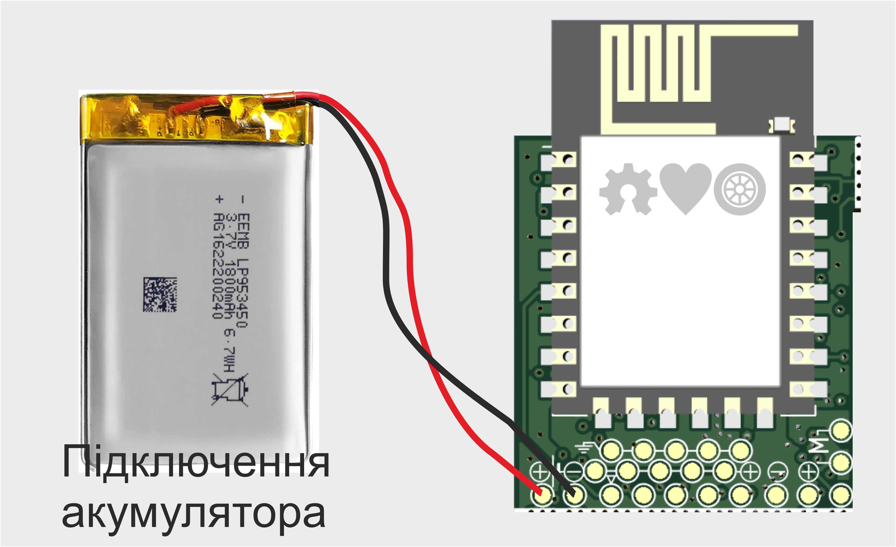

# Model's Heart


## Breathe life into your model

Плата для керування електронікою моделі (статичної/рухомої)
Можливості:
* Керування через WIFI з телефона або ПК
* 5 незалежних каналів (світлодіоди/сервомотори)
* 1 Н-міст для підключення мотора (піковий струм до 3А)
* Вмонтована BMS 1S та контроллер заряду Li-Ion акумулятора з індикацією заряду
* Вмикання/вимикання 1 кнопкою (вже є на платі)
* Дистанційне вимкнення

# Поки ти читаєш цей текст - українці гинуть від російських ракет.
# While you are reading this text, Ukrainians are dying from russian missiles.

Ти можеш перерахувати будь-яку суму на спеціальний рахунок Національного Банку України для допомоги збройним силам україни у протистоянні російському окупанту.

Навіть незначна сума може врятувати чиєсь життя!

You can transfer any amount to a special account of the National Bank of Ukraine to help the armed forces of Ukraine in the fight against the Russian occupier.

Even a small amount can save someone's life!

### Для зарахування коштів у національній валюті:

```
Банк: Національний банк України
МФО 300001
Рахунок № UA843000010000000047330992708
код ЄДРПОУ 00032106
Отримувач: Національний банк України 
```
### To deposit funds in USD: 
```
BENEFICIARY: National Bank of Ukraine
BENEFICIARY BIC: NBUA UA UX
BENEFICIARY ADDRESS: 9 Instytutska St, Kyiv, 01601, Ukraine
ACCOUNT NUMBER: 804790258
BENEFICIARY BANK NAME: JP MORGAN CHASE BANK, New York
BENEFICIARY BANK BIC: CHASUS33
ABA 0210 0002 1
BENEFICIARY BANK ADDRESS: 383 Madison Avenue, New York, NY 10017, USA
PURPOSE OF PAYMENT: for ac 47330992708 
```
### To deposit funds in EUR: 
```
BENEFICIARY: National Bank of Ukraine
IBAN DE05504000005040040066
PURPOSE OF PAYMENT: for ac 47330992708
BENEFICIARY BANK NAME: DEUTSCHE  BUNDESBANK, Frankfurt
BENEFICIARY BANK BIC: MARKDEFF
BENEFICIARY BANK ADDRESS: Wilhelm-Epstein-Strasse 14, 60431 Frankfurt Am Main, Germany
```
### To deposit funds in GBP: 
```
BENEFICIARY/RECIPIENT NAME: National Bank of Ukraine
ACCOUNT NUMBER: 80033041
IBAN GB52CHAS60924280033041
BENEFICIARY ADDRESS: 9 Instytutska St, Kyiv, 01601, Ukraine
BENEFICIARY BANK NAME: JP MORGAN CHASE BANK NA, London
BENEFICIARY BANK BIC: CHASGB2L
SORT CODE: 60-92-42 
BENEFICIARY BANK ADDRESS: 125 London Wall, London EC2Y 5AJ, UK
PURPOSE OF PAYMENT: for ac 47330992708
```


# Schematic


# Board


# Що обрати Model's Heart чи Arduino?

Плата Model's Heart та Arduino  чи Wemos не є взаємозамінні. Вони схожі, проте мають і відмінності. Це як комп'ютери із різною комплектацією. 
Для коащого розуміння ознайомтесь із порівняльоню таблицею.

## Проівняльна таблиця Arduino Nano, Wemos D1, Model's Heart
| Характеристика |Arduino Nano | Wemos D1 | Model's Heart |
|---          |---|---|---|
| Процесор    |Atmega 328| ESP8266  | ESP8266 |
| Ядро        | 8-bit AVR RISC | Tensilica L106 32-bit RISC | Tensilica L106 32-bit RISC |
| Тип         | Microcontroller| Soc  | SoC |
|Оперативня пам'ять|2K bytes|50k bytes|50k bytes|
|Постійна пам'ять|32K bytes інтергрована| - | - |
|Зовнішня пам'ять| - | 16M bytes | 16M bytes |
|Частота процесора| 16MHz | 52MHz | 52Mhz |
|GPIO| 24 | 11 | 8 |
|Analog Pins| 8 | 1 | 1 |
|ADC| 1 | 1 | 1 |
|Точність ADC | 10bit | 10bit | 10bit |
|Wi-Fi | - | 2.4GHz | 2.4GHz |
|USB Power | micro USB | micro USB | Type-C |
|Живлення від Li-Ion | - | - | + |
|Li-Ion BMS | - | - | + |
|Li-Ion Charger | - | - | + |
|Power switch | - | - | + |
|H-Bridge | - | - | 3A (max) |


## У мене вже є плата Model's Heart, що далі?
Базовий набір:
* Завантажена з GitHub копія проекту
* Модуль, або відлагоджувальна плата Model's Heart, або інша  на базі процесора ESP8266 (Наприклад Wemos D1 mini, Lolin, і т.п.)
* Комп'ютер з USB
* Веб-переглядач для налаштування (наприклад Edge, Chrome, Mozilla, Safari, Opera ...)

Додаткові інструменти, якщо ви захочете переробити прошивку під більш складні задачі:
* Visual Studio Code
* Встановлена бібліотека Platformio

## Прошивка
У папці Tools є утиліта для прошивки та безпосередньо сам файл прошивки. Для більшості користувачів цього є цілком достатньо. Виконавши декілька простих кроків, ви зможете перетворити плату у радіоапаратуру для керування моделями.

Покрокова інструкція
1. Підключаєте плату до USB-порту вашого комп'ютера.
2. Встановлюєте драйвер CH340 (якщо його ще немає)
3. Заходите у диспетчер пристроїв і перевіряєте, чи всі драйвери встановлено і чи ваша плата розпізнається системою. 
  * Відкриваєте панель керування комп'ютером. 

  * Переходите на пункт "Диспетчер пристроїв".
Ймовірно, ваша плата буде називатися 'USB-Serial CH340 (COM_)'

  * Запам'ятовуєте, який номер порта отримала ваша плата (у моєму випадку - №3)

4. Запускаєте Tools/upload.bat
5. Після старту скрипт запитає номер порта, до якого під'єднано вашу плату
6. Вводите номер (тільки цифру), натискаєте Enter
7. Натискаєте кнопку Power на платі Model's Heart
8. Чекаєте, поки завершиться процес завантаження

Все - плата прошита.

З цього моменту нею можна користуватись.

## Встановлення поновлень
Поновлення відбувається аналогічно до прошивки. Завантажуєте нову версію репозиторію. А далі все по кроках...

Зважте на те, що прошивка повністю переписує все що є в пам'яті плати. Тобто, якщо ви завантажували в неї модифікації через файловий менеджер, то завантажте їх, щоб не втратити.

# Налаштування елементів UI
Усі елементи користувацького інтерфейсу використовують абсолютну координатну сітку.
Відлік координат починається у верхньому правому кутку.

Робоче поле має фіксовані пропорції 100:45

Розміри елементів інтерфейсу вказуються у відсотковому еквіваленті до ширини робочого поля.

Наприклад цей текстовий блок буде розміщений з відступом 10% з ліва, 20% з гори. Його ширина і висота відповідатимуть відповідно 30% ширини екрану та 40% ширини екрану. Зверніть увагу, що в обидвох випадках (ширина і висота блока) виміри прив'язані до % **ширини екрану**
```
    {
        "type":"text",
        "x": "10",
        "y": "20",
        "w": "30",
        "h": "40",
        "text":"текст"
    }
```

## Text

```
    {
        "type":"text",
        "x": int,
        "y": int,
        "w": int,
        "h": int,
        "text":string,
        "bg":string
    }
```

## Button
```
    {
        "type":"button",
        "x": int,
        "y": int,
        "w": int,
        "h": int,
        "text": string,
        "cmd": string
    }
```

## Slider
```
    {
        "type":"slider",
        "x": int,
        "y": int,
        "w": int,
        "h": int,
        "color": string,
        "cmd": string,
        "autocenter": bool,
    }
```

## Сценарій

Сценарій визначає, як плата реагуватиме на команди користувача. У сценарію є лише одна властивість - "elements" (містить перелік команд)

```
{
    "elements" : [ {"cmd": string, ..}, {..}, ..]
}
```

Команди активуються у результаті взаємодії користувач з UI. Поки команда активна - її дії обробляються, інакше - ігноруються.

Структура команди:

- cmd - назва команди.
- type - тип команди
  * tougle - кожна активація команди вмикає/вимикає її стан
  * click - команда активна поки користувач утримує її значення відмінним від 0
  * none - команда не потребує активації. Вона активна завжди.
- actions - перелік дій, що будуть виконуватись поки команда активна.

```
{
    "cmd": string,
    "type": "tougle/click/none",
    "actions": 
        [
            {
                "type": 
                "cmd": string,
            },
            {
                "type": "motor",
                "speed": string (source of speed value for full H bridge). When set - a+b ignored
                "a": string (source of A half bridge values),
                "b": string (source of B half bridge values),
                "weight": int (in grams)
            },
            {
                "type": "blink",
                "points": [
                    {"pin": "1", "offset":"0", "value":"0"},
                    {"pin": "1", "offset":"500", "value":"255"},
                    {"pin": "1", "offset":"1000", "value":"0"}
                ]
            }
        ...
        ]
}
```
### Дії сценаріїв

#### Маячок
Дія перемикає виходи у заданій часовій точці.

- type - blink
- points - масив точок

Точка:
- pin - номер виходу
- offset - точка часу у мілісекундах. Відлік починається від старту дії
- value - PWM значення виходу

```
{
    "type": "blink",
    "points": [
        {"pin": "1", "offset":"0", "value":"0"},
        {"pin": "1", "offset":"500", "value":"255"},
        {"pin": "1", "offset":"1000", "value":"0"}
    ]
}
```

#### Мотор
Дія використовується для керування мотором.

- type - motor
- speed - назва команди яка використовуються для швидкості мотора
- weight - вага уявного маховика мотора. Використовується для імітації інерції

```
{
    "type":"motor",
    "speed":"motor_x",
    "weight": "80000"
}
```

## Приклади сценаріїв
### Керування гвинтовим літаком

ui.json
```
{
  "elements": [
    {
      "type": "text",
      "x": "0",
      "y": "0",
      "text": "Motor example"
    },
    {
      "type": "slider",
      "x": "56",
      "y": "36",
      "w": "30",
      "h": "5",
      "color": "red",
      "cmd": "motor",
      "autocenter": "y"
    },
    {
      "type": "button",
      "x": "0",
      "y": "10",
      "w": "27",
      "text": "Хвостовий маяк",
      "cmd": "beacon"
    },
    {
      "type": "button",
      "x": "0",
      "y": "15",
      "w": "27",
      "text": "Габаритні маяки",
      "cmd": "strobe"
    },
    {
      "type": "button",
      "x": "0",
      "y": "20",
      "w": "27",
      "text": "Габарити",
      "cmd": "position"
    },
    {
      "type": "button",
      "x": "0",
      "y": "25",
      "w": "27",
      "text": "Посадкові вогні",
      "cmd": "navigation"
    },
    {
      "type": "button",
      "x": "0",
      "y": "30",
      "w": "27",
      "text": "Двигуни",
      "cmd": "ignition"
    }
  ]
}
```

scripts.json
```
{
  "elements": [
    {
      "cmd": "beacon",
      "type": "tougle",
      "actions": [
        {
          "type": "blink",
          "points": [
            {
              "pin": "1",
              "offset": "0",
              "value": "0"
            },
            {
              "pin": "1",
              "offset": "0",
              "value": "0"
            },
            {
              "pin": "1",
              "offset": "100",
              "value": "20"
            },
            {
              "pin": "1",
              "offset": "200",
              "value": "50"
            },
            {
              "pin": "1",
              "offset": "300",
              "value": "90"
            },
            {
              "pin": "1",
              "offset": "400",
              "value": "50"
            },
            {
              "pin": "1",
              "offset": "500",
              "value": "20"
            },
            {
              "pin": "1",
              "offset": "600",
              "value": "0"
            },
            {
              "pin": "1",
              "offset": "1000",
              "value": "0"
            }
          ]
        }
      ]
    },
    {
      "cmd": "strobe",
      "type": "tougle",
      "actions": [
        {
          "type": "blink",
          "points": [
            {
              "pin": "4",
              "offset": "0",
              "value": "0"
            },
            {
              "pin": "4",
              "offset": "0",
              "value": "255"
            },
            {
              "pin": "4",
              "offset": "100",
              "value": "0"
            },
            {
              "pin": "4",
              "offset": "300",
              "value": "255"
            },
            {
              "pin": "4",
              "offset": "400",
              "value": "0"
            },
            {
              "pin": "4",
              "offset": "1000",
              "value": "0"
            }
          ]
        }
      ]
    },
    {
      "cmd": "position",
      "type": "tougle",
      "actions": [
        {
          "type": "blink",
          "points": [
            {
              "pin": "3",
              "offset": "0",
              "value": "0"
            },
            {
              "pin": "3",
              "offset": "0",
              "value": "255"
            },
            {
              "pin": "3",
              "offset": "1000",
              "value": "255"
            }
          ]
        }
      ]
    },
    {
      "cmd": "navigation",
      "type": "tougle",
      "actions": [
        {
          "type": "blink",
          "points": [
            {
              "pin": "2",
              "offset": "0",
              "value": "0"
            },
            {
              "pin": "2",
              "offset": "0",
              "value": "255"
            },
            {
              "pin": "2",
              "offset": "1000",
              "value": "255"
            }
          ]
        }
      ]
    },
    {
      "cmd": "ignition",
      "type": "tougle",
      "actions": [
        {
          "type":"motor",
          "speed":"motor_x",
          "weight": "80000"
        }
      ]
    }
  ]
}
```

# Підключення

## Чи можна розрізати плату?
Плата достатньо мініатюрна і необхідно постаратись її так прилаштувати, щоб не довелось її розрізати. Проте, якщо є необхідність "запакувати" по максимуму, то плату можна розрізати на 3 окремі частини. Після розрізання, їх можна об'єднати провідниками, або використовувати плату без них. Кожна із 3-ох частин є завершеним блоком.


## Підключення окремих блоків плати Model's Heart
### Плата зарядки
Плата зарядки - може використовуватись як зарядний пристрій Li-Ion акумуляторів.


### Плата програматора

Плату програматора можна використовувати як окремий USB<->TTL перетворювач.


### Основна плата
#### Підключення акумулятора


#### Підключення мотора


#### Підключення кнопки вкл./викл.


#### Підключення світлодіода до виходу #1


#### Підключення світлодіода до шини живлення #2
При підключенні світлодіода до шини живлення необхідно обмежити струм з допомогою резистора. Типовий струм для світлодіодів - 2мА

Опір обмежувального резистора можна розрахувати за законом Ома

```
Закон Ома

  I = U/R 

Де:
  I - струм, що протікає через коло в Амперах
  U - напруга на кінцях кола у Вольтах
  R - опір кола у Омах

Знаходимо R

  R = U/I 

  U = 4.2V
  I = 2mA = 0.002A

  R = 4.2V / 0.002A 
  R = 2100 Ом => 2.1KOм

```


# Web API

Взаємодія web інтерфейсу та плати відбувається по WIF з допомогою HTTP запитів.

Плата Model's Heart дозволяє одночасне керування з кількох клієнтів.
Для того, щоб надіслані команди відпрацьовувались платою - необхідна авторизація (GET api/EventSourceName). У відповідь ми отримаємо endpoint з допомогою якого можна підписатись на HTTP Events (GET /api/events), щоб отримувати інформацію від плати. Також, щоразу як користувач змінив стан поля відбувається пересилка цього стану у плату (POST api/post)


## GET api/EventSourceName
Метод повертає Endpoint (адресу джерела Events) по якому транслюється інформація з плати на web-UI. Одним із параметрів є ID клієнта

## GET /api/events 
Встановлюється як EventSource для сторінки Web інтерфейсу
Детальніше тут ->  https://developer.mozilla.org/en-US/docs/Web/API/EventSource

## POST api/post
Надсилаємо інформацію про поле на плату
```
{
  client:"random string id of client"
  format:[field1, field2, field, ... fieldN],
  values:['v1', 'v2', 'v3', .. 'vN']
}
```

- client - ID клієнта
- format - назви полів які наявні у інтерфейсі. Надсилається лише один раз. Всі інші рази ігнорується. Цього формату має притримуватись додаток при комунікації з приладом, і в такому ж форматі має відповідати плата. (це для того, щоб мінімізувати трафік і одночасно забезпечити підтримку стрих версій додатку у яких може бути інша конфігурація елементів керування)
- values - значення полів у посортовані відповідно до format.

## Алгоритм взаємодії
1. Авторизація
2. Налаштовуємо EventSource. 
3. POST api/post формат даних
4. По Event source каналу отримуємо від плати масив значень і розставляємо їх по елементах керування у відповідності до обговореного формату
5. Якщо користувач змінив якийсь параметр - надсилаємо платі пакет у обговореному наперед форматі. (Повертаємось до п4)
6. Якщо зв'язок втрачено - запускаємо зворотній відлік на 3 секунди і пробуємо відновити зв'язок (Повертаємось до п1)
