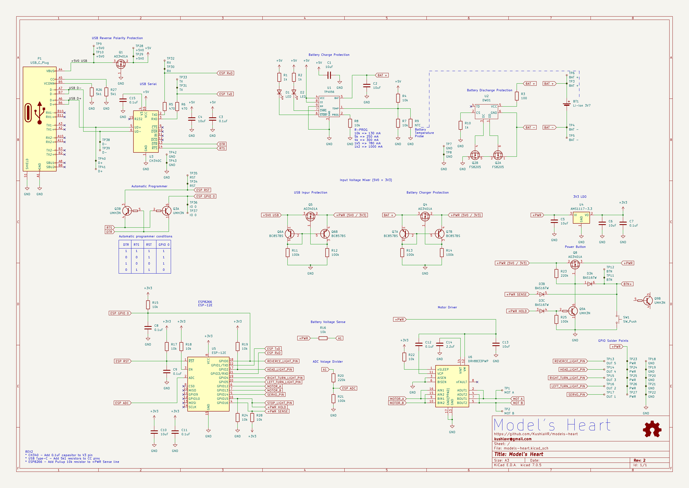

# Model's Heart

## Breathe life into your model

# Поки ти читаєш цей текст - українці гинуть від російських ракет.

Ти можеш перерахувати будь-яку суму на спеціальний рахунок Національного Банку України для допомоги збройним силам україни у протистоянні російському окупанту.
Навть незначна сума може врятувати чиєсь життя!

### Для зарахування коштів у національній валюті:

Банк: Національний банк України

МФО 300001

Рахунок № UA843000010000000047330992708

код ЄДРПОУ 00032106

Отримувач: Національний банк України 

### Для зарахування коштів у USD: 

BENEFICIARY: National Bank of Ukraine

BENEFICIARY BIC: NBUA UA UX

BENEFICIARY ADDRESS: 9 Instytutska St, Kyiv, 01601, Ukraine

ACCOUNT NUMBER: 804790258

BENEFICIARY BANK NAME: JP MORGAN CHASE BANK, New York

BENEFICIARY BANK BIC: CHASUS33

ABA 0210 0002 1

BENEFICIARY BANK ADDRESS: 383 Madison Avenue, New York, NY 10017, USA

PURPOSE OF PAYMENT: for ac 47330992708 

### Для зарахування коштів у EUR: 

BENEFICIARY: National Bank of Ukraine

IBAN DE05504000005040040066

PURPOSE OF PAYMENT: for ac 47330992708

BENEFICIARY BANK NAME: DEUTSCHE  BUNDESBANK, Frankfurt

BENEFICIARY BANK BIC: MARKDEFF

BENEFICIARY BANK ADDRESS: Wilhelm-Epstein-Strasse 14, 60431 Frankfurt Am Main, Germany

### Для зарахування коштів у GBP: 

BENEFICIARY/RECIPIENT NAME: National Bank of Ukraine

ACCOUNT NUMBER: 80033041

IBAN GB52CHAS60924280033041

BENEFICIARY ADDRESS: 9 Instytutska St, Kyiv, 01601, Ukraine

BENEFICIARY BANK NAME: JP MORGAN CHASE BANK NA, London

BENEFICIARY BANK BIC: CHASGB2L

SORT CODE: 60-92-42 

BENEFICIARY BANK ADDRESS: 125 London Wall, London EC2Y 5AJ, UK

PURPOSE OF PAYMENT: for ac 47330992708

## Schematic

## PCB

# Board

