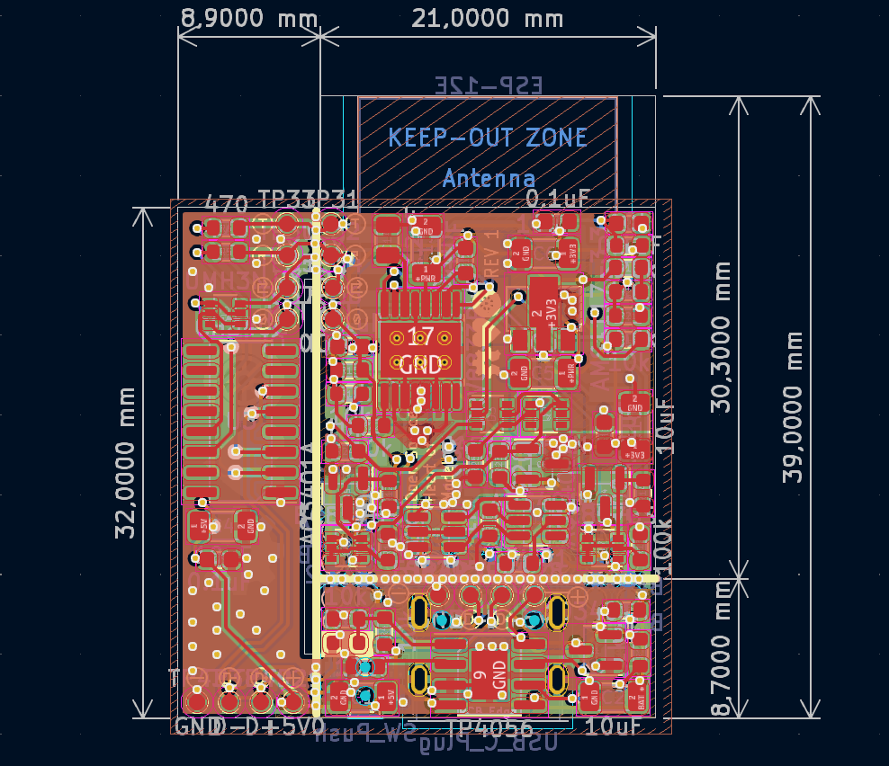

# Model's Heart

## Breathe life into your model


# Поки ти читаєш цей текст - українці гинуть від російських ракет.

Ти можеш перерахувати будь-яку суму на спеціальний рахунок Національного Банку України для допомоги збройним силам україни у протистоянні російському окупанту.
Навть незначна сума може врятувати чиєсь життя!

### Для зарахування коштів у національній валюті:

Банк: Національний банк України

МФО 300001

Рахунок № UA843000010000000047330992708

код ЄДРПОУ 00032106

Отримувач: Національний банк України 

### Для зарахування коштів у USD: 

BENEFICIARY: National Bank of Ukraine

BENEFICIARY BIC: NBUA UA UX

BENEFICIARY ADDRESS: 9 Instytutska St, Kyiv, 01601, Ukraine

ACCOUNT NUMBER: 804790258

BENEFICIARY BANK NAME: JP MORGAN CHASE BANK, New York

BENEFICIARY BANK BIC: CHASUS33

ABA 0210 0002 1

BENEFICIARY BANK ADDRESS: 383 Madison Avenue, New York, NY 10017, USA

PURPOSE OF PAYMENT: for ac 47330992708 

### Для зарахування коштів у EUR: 

BENEFICIARY: National Bank of Ukraine

IBAN DE05504000005040040066

PURPOSE OF PAYMENT: for ac 47330992708

BENEFICIARY BANK NAME: DEUTSCHE  BUNDESBANK, Frankfurt

BENEFICIARY BANK BIC: MARKDEFF

BENEFICIARY BANK ADDRESS: Wilhelm-Epstein-Strasse 14, 60431 Frankfurt Am Main, Germany

### Для зарахування коштів у GBP: 

BENEFICIARY/RECIPIENT NAME: National Bank of Ukraine

ACCOUNT NUMBER: 80033041

IBAN GB52CHAS60924280033041

BENEFICIARY ADDRESS: 9 Instytutska St, Kyiv, 01601, Ukraine

BENEFICIARY BANK NAME: JP MORGAN CHASE BANK NA, London

BENEFICIARY BANK BIC: CHASGB2L

SORT CODE: 60-92-42 

BENEFICIARY BANK ADDRESS: 125 London Wall, London EC2Y 5AJ, UK

PURPOSE OF PAYMENT: for ac 47330992708


## Schematic


## PCB



# Board


## Що необхідно?
Базовий набір:
* Завантажена з GitHub копія проекту
* Модуль, або відлагоджувальна плата на базі процесора ESP8266 (Наприклад Model's Heart, Wemos D1 mini, Lolin, або інша)
* Комп'ютер з USB
* Веб-переглядач для налаштування (наприклад Edge, Chrome, Mozilla, Safari, Opera ...)

Додаткові інструменти, якщо ви захочете переробити прошивку під більш складні задачі:
* Visual Studio Code
* Встановлена бібіліотека Platformio

## Прошивка

У папці Tools є утиліта для прошивки та безпосередньо сам файл прошивки. Для більшості користувачів цього є цілком достатньо. Виконавши декілька простих кроків, ви зможете перетворити плату у радіоапаратуру для керування моделями.

Покрокова інструкція
1. Підключаєте плату до USB-порту вашого комп'ютера.
2. Встановлюєте драйвер CH340 (якщо його ще немає)
3. Заходите у диспечер пристроїів і перевіряєте, чи всі драйвери встановлено і чи ваша плата розпізнається системою. 
  * Відкриваєте панель керування комп'ютером. 

  * Переходите на пункт "Диспетчер пристроїв".
Ймовірно, ваша плата буде називатися 'USB-Serial CH340 (COM_)'

  * Запамятовуєте, який номер порта отримала ваша плата (у моєму випадку - №3)

4. Запускаєте Tools/upload.bat
5. Після старту скрипт запитає номер порта, до якого під'єднано вашу плату
6. Вводите номер (тільки цифру), натискаєте Enter
7. Натискаєте кнопку Power на платі Model's Heart
8. Чекаєте, поки завершиться процеc завантаження

Все - плата прошита.

З цього моменту нею можна користуватись.

## Встановлення поновлень
Поновлення відбувається аналогічно до прошивки. Завантажуєте нову версію репозиторія. А далі все по кроках...

Зважте на те, що прошивка повністю переписує все що є в памяті плати. Тобто, якщо ви завантажували в неї модифікації через файловий менеджер, то скачайте їх, щоб не втратити.

# Елементи UI
Усі елементи користувацького інтерфейсу використовують абсолютну координатну сітку.
Відлік кордина починаться у верхньому правому кутку.

Робоче поле має фіксовані пропорції 100:45

Розміри елементів інтерфейсу вказуються у відсотковому еквіваленті до ширни робочого поля.

Наприклад цей текстовий блок буде розміщений з відступом 10% з ліва, 20% з гори. Його ширина і висота відповідатимуть відповідно 30% ширини екрану та 40% ширини екрану. Зверніть увагу, що в обидвох випадках (ширина і висота блока) виміри привязані до % **ширини екрану**
```
    {
        "type":"text",
        "x": "10",
        "y": "20",
        "w": "30",
        "h": "40",
        "text":"текст"
    }
```

## Text

```
    {
        "type":"text",
        "x": int,
        "y": int,
        "w": int,
        "h": int,
        "text":string,
        "bg":string
    }
```

## Button
```
    {
        "type":"button",
        "x": int,
        "y": int,
        "w": int,
        "h": int,
        "text": string,
        "cmd": string
    }
```

## Slider
```
    {
        "type":"slider",
        "x": int,
        "y": int,
        "w": int,
        "h": int,
        "color": string,
        "cmd": string,
        "autoconter": bool,
    }
```

## Сценрій


```
    {
        "cmd": string,
        "type": "tougle/click/none",
        "actions": 
            [
                {
                    "type": 
                    "cmd": string,
                },
                {
                    "type": "motor",
                    "speed": string (source of speed value for full H bridge). When set - a+b ignored
                    "a": string (source of A half bridge values),
                    "b": string (source of B half bridge values),
                    "weight": int (in grams)
                },
                {
                    "type": "blink",
                    "points": [
                        {"pin": "1", "offset":"0", "value":"0"},
                        {"pin": "1", "offset":"500", "value":"255"},
                        {"pin": "1", "offset":"1000", "value":"0"}
                    ]
                }
            ...
            ]

    }
```


## Приклади сценаріїв
### Керування гвинтовим літаком

ui.json
```
{
    "elements": [
        {
            "type": "text",
            "x": 0,
            "y": 0,
            "text": "Motor example"
        },
        {
            "type": "slider",
            "x": "2",
            "y": "7",
            "w": "35",
            "h": "35",
            "color": "red",
            "cmd": "motor",
            "autoconter": "1"
        },
        {
            "type": "button",
            "x": "45",
            "y": "7",
            "text": "Beacon",
            "cmd": "beacon"
        },
        {
            "type": "button",
            "x": "45",
            "y": "14",
            "text": "Strobe lights",
            "cmd": "strobe"
        },
        {
            "type": "button",
            "x": "45",
            "y": "14",
            "text": "Position lights",
            "cmd": "position"
        },
        {
            "type": "button",
            "x": "45",
            "y": "14",
            "text": "Navigation light",
            "cmd": "navigation"
        }
    ]
}
```

scripts.json
```

{
    "elements": [
        {
            "cmd": "beacon",
            "type": "tougle",
            "actions": [
                {
                    "type": "blink",
                    "points": [
                        {
                            "pin": "1",
                            "offset": "0",
                            "value": "0"
                        },
                        {
                            "pin": "1",
                            "offset": "0",
                            "value": "0"
                        },
                        {
                            "pin": "1",
                            "offset": "100",
                            "value": "20"
                        },
                        {
                            "pin": "1",
                            "offset": "200",
                            "value": "50"
                        },
                        {
                            "pin": "1",
                            "offset": "300",
                            "value": "90"
                        },
                        {
                            "pin": "1",
                            "offset": "400",
                            "value": "50"
                        },
                        {
                            "pin": "1",
                            "offset": "500",
                            "value": "20"
                        },
                        {
                            "pin": "1",
                            "offset": "600",
                            "value": "0"
                        },
                        {
                            "pin": "1",
                            "offset": "1000",
                            "value": "0"
                        }
                    ]
                }
            ]
        },
        {
            "cmd": "strobe",
            "type": "tougle",
            "actions": [
                {
                    "type": "blink",
                    "points": [
                        {
                            "pin": "4",
                            "offset": "0",
                            "value": "0"
                        },
                        {
                            "pin": "4",
                            "offset": "0",
                            "value": "255"
                        },
                        {
                            "pin": "4",
                            "offset": "100",
                            "value": "0"
                        },
                        {
                            "pin": "4",
                            "offset": "300",
                            "value": "255"
                        },
                        {
                            "pin": "4",
                            "offset": "400",
                            "value": "0"
                        },
                        {
                            "pin": "4",
                            "offset": "1000",
                            "value": "0"
                        }
                    ]
                }
            ]
        },
        {
            "cmd": "position",
            "type": "tougle",
            "actions": [
                {
                    "type": "blink",
                    "points": [
                        {
                            "pin": "3",
                            "offset": "0",
                            "value": "0"
                        },
                        {
                            "pin": "3",
                            "offset": "0",
                            "value": "255"
                        },
                        {
                            "pin": "3",
                            "offset": "1000",
                            "value": "255"
                        }
                    ]
                }
            ]
        },
        {
            "cmd": "navigation",
            "type": "tougle",
            "actions": [
                {
                    "type": "blink",
                    "points": [
                        {
                            "pin": "2",
                            "offset": "0",
                            "value": "0"
                        },
                        {
                            "pin": "2",
                            "offset": "0",
                            "value": "255"
                        },
                        {
                            "pin": "2",
                            "offset": "1000",
                            "value": "255"
                        }
                    ]
                }
            ]
        }
    ]
}


```